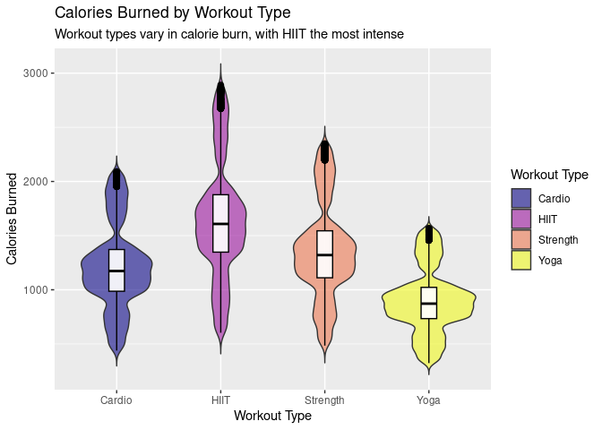
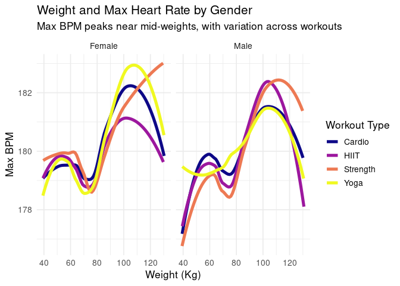
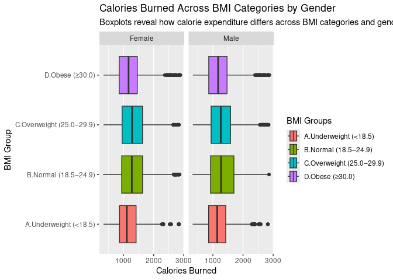

Project memo
================
Aasya, Rachel, Fraol, Hannah

This document should contain a detailed account of the data clean up for
your data and the design choices you are making for your plots. For
instance you will want to document choices you’ve made that were
intentional for your graphic, e.g. color you’ve chosen for the plot.
Think of this document as a code script someone can follow to reproduce
the data cleaning steps and graphics in your handout.

``` r
library(tidyverse)
library(broom)
library(hexbin)
```

## Data Clean Up Steps for Overall Data

### Step 1: Read the dataset

We first look at the full lifestyle dataset and checked its structure to
understand the variables and types.

``` r
Final_data <- read_csv("../data/Final_data.csv")
```

    ## Rows: 20000 Columns: 54
    ## ── Column specification ────────────────────────────────────────────────────────
    ## Delimiter: ","
    ## chr (15): Gender, Workout_Type, meal_name, meal_type, diet_type, cooking_met...
    ## dbl (39): Age, Weight (kg), Height (m), Max_BPM, Avg_BPM, Resting_BPM, Sessi...
    ## 
    ## ℹ Use `spec()` to retrieve the full column specification for this data.
    ## ℹ Specify the column types or set `show_col_types = FALSE` to quiet this message.

``` r
glimpse(Final_data)
```

    ## Rows: 20,000
    ## Columns: 54
    ## $ Age                              <dbl> 34.91, 23.37, 33.20, 38.69, 45.09, 53…
    ## $ Gender                           <chr> "Male", "Female", "Female", "Female",…
    ## $ `Weight (kg)`                    <dbl> 65.27, 56.41, 58.98, 93.78, 52.42, 10…
    ## $ `Height (m)`                     <dbl> 1.62, 1.55, 1.67, 1.70, 1.88, 1.84, 1…
    ## $ Max_BPM                          <dbl> 188.58, 179.43, 175.04, 191.21, 193.5…
    ## $ Avg_BPM                          <dbl> 157.65, 131.75, 123.95, 155.10, 152.8…
    ## $ Resting_BPM                      <dbl> 69.05, 73.18, 54.96, 50.07, 70.84, 61…
    ## $ `Session_Duration (hours)`       <dbl> 1.00, 1.37, 0.91, 1.10, 1.08, 0.69, 1…
    ## $ Calories_Burned                  <dbl> 1080.90, 1809.91, 802.26, 1450.79, 11…
    ## $ Workout_Type                     <chr> "Strength", "HIIT", "Cardio", "HIIT",…
    ## $ Fat_Percentage                   <dbl> 26.80038, 27.65502, 24.32082, 32.8135…
    ## $ `Water_Intake (liters)`          <dbl> 1.50, 1.90, 1.88, 2.50, 2.91, 2.91, 2…
    ## $ `Workout_Frequency (days/week)`  <dbl> 3.99, 4.00, 2.99, 3.99, 4.00, 3.02, 4…
    ## $ Experience_Level                 <dbl> 2.01, 2.01, 1.02, 1.99, 2.00, 1.00, 3…
    ## $ BMI                              <dbl> 24.87, 23.48, 21.15, 32.45, 14.83, 31…
    ## $ `Daily meals frequency`          <dbl> 2.99, 3.01, 1.99, 3.00, 3.00, 2.99, 2…
    ## $ `Physical exercise`              <dbl> 0.01, 0.97, -0.02, 0.04, 3.00, -0.04,…
    ## $ Carbs                            <dbl> 267.68, 214.32, 246.04, 203.22, 332.7…
    ## $ Proteins                         <dbl> 106.05, 85.41, 98.11, 80.84, 133.05, …
    ## $ Fats                             <dbl> 71.63, 56.97, 65.48, 54.56, 88.43, 46…
    ## $ Calories                         <dbl> 1806, 1577, 1608, 2657, 1470, 2767, 1…
    ## $ meal_name                        <chr> "Other", "Other", "Other", "Other", "…
    ## $ meal_type                        <chr> "Lunch", "Lunch", "Breakfast", "Lunch…
    ## $ diet_type                        <chr> "Vegan", "Vegetarian", "Paleo", "Pale…
    ## $ sugar_g                          <dbl> 31.77, 12.34, 42.81, 9.34, 23.78, 15.…
    ## $ sodium_mg                        <dbl> 1729.94, 693.08, 2142.48, 123.20, 193…
    ## $ cholesterol_mg                   <dbl> 285.05, 300.61, 215.42, 9.70, 116.89,…
    ## $ serving_size_g                   <dbl> 120.47, 109.15, 399.43, 314.31, 99.22…
    ## $ cooking_method                   <chr> "Grilled", "Fried", "Boiled", "Fried"…
    ## $ prep_time_min                    <dbl> 16.24, 16.47, 54.35, 27.73, 34.16, 20…
    ## $ cook_time_min                    <dbl> 110.79, 12.01, 6.09, 103.72, 46.55, 5…
    ## $ rating                           <dbl> 1.31, 1.92, 4.70, 4.85, 3.07, 3.38, 3…
    ## $ `Name of Exercise`               <chr> "Decline Push-ups", "Bear Crawls", "D…
    ## $ Sets                             <dbl> 4.99, 4.01, 5.00, 4.01, 4.99, 4.00, 5…
    ## $ Reps                             <dbl> 20.91, 16.15, 21.90, 16.92, 15.01, 25…
    ## $ Benefit                          <chr> "Improves shoulder health and posture…
    ## $ `Burns Calories (per 30 min)`    <dbl> 342.58, 357.16, 359.63, 351.65, 329.3…
    ## $ `Target Muscle Group`            <chr> "Shoulders, Triceps", "Back, Core, Sh…
    ## $ `Equipment Needed`               <chr> "Cable Machine", "Step or Box", "Step…
    ## $ `Difficulty Level`               <chr> "Advanced", "Intermediate", "Intermed…
    ## $ `Body Part`                      <chr> "Legs", "Chest", "Arms", "Shoulders",…
    ## $ `Type of Muscle`                 <chr> "Lats", "Lats", "Grip Strength", "Upp…
    ## $ Workout                          <chr> "Dumbbell flyes", "Lateral raises", "…
    ## $ BMI_calc                         <dbl> 24.87045, 23.47971, 21.14812, 32.4498…
    ## $ cal_from_macros                  <dbl> 2139.59, 1711.65, 1965.92, 1627.28, 2…
    ## $ pct_carbs                        <dbl> 0.5004323, 0.5008501, 0.5006104, 0.49…
    ## $ protein_per_kg                   <dbl> 1.6247893, 1.5140932, 1.6634452, 0.86…
    ## $ pct_HRR                          <dbl> 0.7412365, 0.5512471, 0.5745336, 0.74…
    ## $ pct_maxHR                        <dbl> 0.8359847, 0.7342696, 0.7081239, 0.81…
    ## $ cal_balance                      <dbl> 725.10, -232.91, 805.74, 1206.21, 303…
    ## $ lean_mass_kg                     <dbl> 47.77739, 40.80980, 44.63558, 63.0074…
    ## $ expected_burn                    <dbl> 685.1600, 978.6184, 654.5266, 773.630…
    ## $ `Burns Calories (per 30 min)_bc` <dbl> 7.260425e+19, 1.020506e+20, 1.079607e…
    ## $ Burns_Calories_Bin               <chr> "Medium", "High", "High", "High", "Lo…

### Step 2: Select 11 variables for our research questions

We chose these 11 variables out of 50 to investigate our particular
research questions about workout intensity, heart rate, and physical
characteristics.

``` r
Final_data |> 
  select(Age, Gender, `Weight (kg)`, `Height (m)` , Max_BPM, Avg_BPM, Resting_BPM, `Session_Duration (hours)` , Calories_Burned, Workout_Type, BMI) |>
  summary()
```

    ##       Age           Gender           Weight (kg)       Height (m)   
    ##  Min.   :18.00   Length:20000       Min.   : 39.18   Min.   :1.490  
    ##  1st Qu.:28.17   Class :character   1st Qu.: 58.16   1st Qu.:1.620  
    ##  Median :39.87   Mode  :character   Median : 70.00   Median :1.710  
    ##  Mean   :38.85                      Mean   : 73.90   Mean   :1.723  
    ##  3rd Qu.:49.63                      3rd Qu.: 86.10   3rd Qu.:1.800  
    ##  Max.   :59.67                      Max.   :130.77   Max.   :2.010  
    ##     Max_BPM         Avg_BPM       Resting_BPM    Session_Duration (hours)
    ##  Min.   :159.3   Min.   :119.1   Min.   :49.49   Min.   :0.490           
    ##  1st Qu.:170.1   1st Qu.:131.2   1st Qu.:55.96   1st Qu.:1.050           
    ##  Median :180.1   Median :143.0   Median :62.20   Median :1.270           
    ##  Mean   :179.9   Mean   :143.7   Mean   :62.20   Mean   :1.259           
    ##  3rd Qu.:189.4   3rd Qu.:156.1   3rd Qu.:68.09   3rd Qu.:1.460           
    ##  Max.   :199.6   Max.   :169.8   Max.   :74.50   Max.   :2.020           
    ##  Calories_Burned  Workout_Type            BMI       
    ##  Min.   : 323.1   Length:20000       Min.   :12.04  
    ##  1st Qu.: 910.8   Class :character   1st Qu.:20.10  
    ##  Median :1231.5   Mode  :character   Median :24.12  
    ##  Mean   :1280.1                      Mean   :24.92  
    ##  3rd Qu.:1553.1                      3rd Qu.:28.56  
    ##  Max.   :2890.8                      Max.   :50.23

### Step 3: Create BMI groups

We created BMI groups in our data to be able to investigate the overall
trends in BMI more clearly for calorie burn. We used standard BMI
cutoffs.

``` r
Final_data <- Final_data %>%
  mutate(BMI_group = case_when(
      BMI < 18.5                     ~ "A.Underweight (<18.5)",
      BMI >= 18.5 & BMI <= 24.9      ~ "B.Normal (18.5–24.9)",
      BMI >= 25   & BMI <= 29.9      ~ "C.Overweight (25.0–29.9)",
      BMI >= 30                      ~ "D.Obese (≥30.0)",
  )
  ) %>%
  filter(!is.na(BMI_group))
```

## Plots

### ggsave example for saving plots

``` r
p1 <- starwars |>
  filter(mass < 1000, 
         species %in% c("Human", "Cerean", "Pau'an", "Droid", "Gungan")) |>
  ggplot() +
  geom_point(aes(x = mass, 
                 y = height, 
                 color = species)) +
  labs(x = "Weight (kg)", 
       y = "Height (m)",
       color = "Species",
       title = "Weight and Height of Select Starwars Species",
       caption = paste("This data comes from the starwars api: https://swapi.py43.com"))


ggsave("example-starwars.png", width = 4, height = 4)

ggsave("example-starwars-wide.png", width = 6, height = 4)
```

#### Final Plot 1: Calories Burned by Workout Type (Violin + Boxplots)

We decided to do a violin plot with a boxplot overlaid investigating how
workout type could affect the calories burned of an individual.
Incorporating feedback from our presentation, we outlined the yellow
color to make it more clear. We used the viridis palette for color-blind
viewers.

``` r
ggplot(Final_data, aes(x = Workout_Type, y = Calories_Burned, fill = Workout_Type)) +
  geom_violin(alpha = 0.6, trim = FALSE) +
  geom_boxplot(width = 0.15,
               color = "black",     
               fill = "white",  
               outlier.color = "black", 
               outlier.size = 2,alpha = 0.9) +
  scale_fill_viridis_d(option = "plasma") +
  labs(
    title = "Calories Burned by Workout Type",
    subtitle = "Workout types vary in calorie burn, with HIIT the most intense",
    x = "Workout Type",
    y = "Calories Burned",
    fill = "Workout Type"
  ) +
  theme(legend.position = "right")
```



``` r
ggsave("/cloud/project/workouttype.pdf")
```

    ## Saving 7 x 5 in image

``` r
ggsave("/cloud/project/workouttype.png")
```

    ## Saving 7 x 5 in image

#### Final Plot 2: Weight vs Max BPM by Workout Type, Faceted by Gender

We created a plot showing how weight can affect max BPM, and how it
changed across workout type and gender. After getting feedback when we
presented we faceted it by gender which makes trends clearer. Workout
type is used with a viridis palette for accessibility. We also used
loess smoothing curves to depict the trends better than many overlapping
points.

``` r
ggplot(Final_data, aes(x = `Weight (kg)`, y = Max_BPM, color = Workout_Type )) +
  geom_smooth(se = FALSE, method = "loess", size = 1.8) +
  scale_color_viridis_d(option = "plasma") +
  labs(
    title = "Weight and Max Heart Rate by Gender",
    subtitle = "Max BPM peaks near mid-weights, with variation across workouts",
    x = "Weight (Kg)",
    y = "Max BPM",
    color = "Workout Type"
  ) +
  facet_wrap(~Gender) +
  theme_minimal(base_size = 13)
```

    ## Warning: Using `size` aesthetic for lines was deprecated in ggplot2 3.4.0.
    ## ℹ Please use `linewidth` instead.
    ## This warning is displayed once every 8 hours.
    ## Call `lifecycle::last_lifecycle_warnings()` to see where this warning was
    ## generated.

    ## `geom_smooth()` using formula = 'y ~ x'



``` r
ggsave("/cloud/project/maxBPM.pdf")
```

    ## Saving 7 x 5 in image
    ## `geom_smooth()` using formula = 'y ~ x'

``` r
ggsave("/cloud/project/maxBPM.png")
```

    ## Saving 7 x 5 in image
    ## `geom_smooth()` using formula = 'y ~ x'

#### Final Plot 3: BMI groups vs. Calories Burned, Facted by Gender

We created a boxplot to compare calories burned across different BMI
groups and gender. Since the raw values had wide variation, we used
boxplots to show the distribution more clearly. After receiving
feedback, we added faceting by gender so the differences between male
and female participants are easier to see. Creating BMI groups from the
numeric BMI variable also helped make patterns more interpretable when
comparing how calorie expenditure differs across categories.

``` r
ggplot(Final_data, aes(x = Calories_Burned , y = BMI_group, fill = BMI_group)) +
  geom_boxplot() +
  facet_wrap(~ Gender) +
  scale_color_viridis_d(option = "plasma") +
  labs(
    title = "Calories Burned Across BMI Categories by Gender",
    subtitle = "Boxplots reveal how calorie expenditure differs across BMI categories and genders",
    y = "BMI Group",
    x = "Calories Burned",
    fill = "BMI Groups"
  ) +
  theme(legend.position = "right")
```



``` r
ggsave("/cloud/project/BMIgroups.pdf")
```

    ## Saving 7 x 5 in image

    ## Warning in grid.Call.graphics(C_text, as.graphicsAnnot(x$label), x$x, x$y, :
    ## for 'B.Normal (18.5–24.9)' in 'mbcsToSbcs': - substituted for – (U+2013)

    ## Warning in grid.Call.graphics(C_text, as.graphicsAnnot(x$label), x$x, x$y, :
    ## for 'C.Overweight (25.0–29.9)' in 'mbcsToSbcs': - substituted for – (U+2013)

    ## Warning in grid.Call.graphics(C_text, as.graphicsAnnot(x$label), x$x, x$y, :
    ## for 'D.Obese (≥30.0)' in 'mbcsToSbcs': >= substituted for ≥ (U+2265)

    ## Warning in grid.Call.graphics(C_text, as.graphicsAnnot(x$label), x$x, x$y, :
    ## for 'B.Normal (18.5–24.9)' in 'mbcsToSbcs': - substituted for – (U+2013)

    ## Warning in grid.Call.graphics(C_text, as.graphicsAnnot(x$label), x$x, x$y, :
    ## for 'C.Overweight (25.0–29.9)' in 'mbcsToSbcs': - substituted for – (U+2013)

    ## Warning in grid.Call.graphics(C_text, as.graphicsAnnot(x$label), x$x, x$y, :
    ## for 'D.Obese (≥30.0)' in 'mbcsToSbcs': >= substituted for ≥ (U+2265)

``` r
ggsave("/cloud/project/BMIgroups.png")
```

    ## Saving 7 x 5 in image
