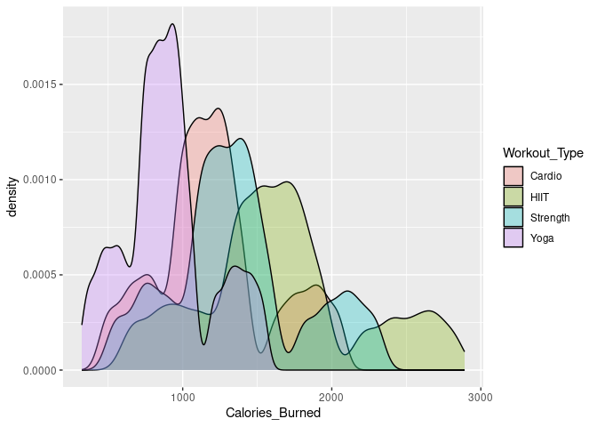

Project proposal
================
ARHF

``` r
library(tidyverse)
library(broom)
## Add any additional packages you are using here
```

## 1. Introduction

The lifestyle dataset was curated by Omar Essa. While the specific
method of data collection is not documented, it appears to come from an
experimental study that tracked participants’ health and fitness metrics
over time. Participants’ physiological and workout-related data were
recorded, likely through wearable fitness devices or controlled
monitoring during exercise sessions.

Our subset of the dataset includes 11 variables describing demographic,
physical, and workout information for each participant. These include:

Age, Gender, Weight, and Height — basic demographic and body
measurements.

Max_BPM, Avg_BPM, and Resting_BPM — heart rate data capturing intensity
and recovery.

Session_Duration and Calories_Burned — indicators of workout duration
and energy expenditure.

Workout_Type — the kind of exercise performed (e.g., Strength, HIIT,
Cardio).

BMI — a calculated measure of body fat based on weight and height.

For this research project we are looking to see these questions:

1.  How do different workout types (Strength, HIIT, Cardio) affect an
    individual’s heart rate response (Max_BPM, Avg_BPM, and
    Resting_BPM)?

2.  How do physical characteristics such as BMI, weight, and age
    influence calories burned and heart rate during workouts?

## 2. Data

There are 54 columns and 2000 rows. For this project we will focus on 11
relevant variables.

``` r
Final_data <- read_csv("../data/Final_data.csv")
```

    ## Rows: 20000 Columns: 54
    ## ── Column specification ────────────────────────────────────────────────────────
    ## Delimiter: ","
    ## chr (15): Gender, Workout_Type, meal_name, meal_type, diet_type, cooking_met...
    ## dbl (39): Age, Weight (kg), Height (m), Max_BPM, Avg_BPM, Resting_BPM, Sessi...
    ## 
    ## ℹ Use `spec()` to retrieve the full column specification for this data.
    ## ℹ Specify the column types or set `show_col_types = FALSE` to quiet this message.

``` r
glimpse(Final_data)
```

    ## Rows: 20,000
    ## Columns: 54
    ## $ Age                              <dbl> 34.91, 23.37, 33.20, 38.69, 45.09, 53…
    ## $ Gender                           <chr> "Male", "Female", "Female", "Female",…
    ## $ `Weight (kg)`                    <dbl> 65.27, 56.41, 58.98, 93.78, 52.42, 10…
    ## $ `Height (m)`                     <dbl> 1.62, 1.55, 1.67, 1.70, 1.88, 1.84, 1…
    ## $ Max_BPM                          <dbl> 188.58, 179.43, 175.04, 191.21, 193.5…
    ## $ Avg_BPM                          <dbl> 157.65, 131.75, 123.95, 155.10, 152.8…
    ## $ Resting_BPM                      <dbl> 69.05, 73.18, 54.96, 50.07, 70.84, 61…
    ## $ `Session_Duration (hours)`       <dbl> 1.00, 1.37, 0.91, 1.10, 1.08, 0.69, 1…
    ## $ Calories_Burned                  <dbl> 1080.90, 1809.91, 802.26, 1450.79, 11…
    ## $ Workout_Type                     <chr> "Strength", "HIIT", "Cardio", "HIIT",…
    ## $ Fat_Percentage                   <dbl> 26.80038, 27.65502, 24.32082, 32.8135…
    ## $ `Water_Intake (liters)`          <dbl> 1.50, 1.90, 1.88, 2.50, 2.91, 2.91, 2…
    ## $ `Workout_Frequency (days/week)`  <dbl> 3.99, 4.00, 2.99, 3.99, 4.00, 3.02, 4…
    ## $ Experience_Level                 <dbl> 2.01, 2.01, 1.02, 1.99, 2.00, 1.00, 3…
    ## $ BMI                              <dbl> 24.87, 23.48, 21.15, 32.45, 14.83, 31…
    ## $ `Daily meals frequency`          <dbl> 2.99, 3.01, 1.99, 3.00, 3.00, 2.99, 2…
    ## $ `Physical exercise`              <dbl> 0.01, 0.97, -0.02, 0.04, 3.00, -0.04,…
    ## $ Carbs                            <dbl> 267.68, 214.32, 246.04, 203.22, 332.7…
    ## $ Proteins                         <dbl> 106.05, 85.41, 98.11, 80.84, 133.05, …
    ## $ Fats                             <dbl> 71.63, 56.97, 65.48, 54.56, 88.43, 46…
    ## $ Calories                         <dbl> 1806, 1577, 1608, 2657, 1470, 2767, 1…
    ## $ meal_name                        <chr> "Other", "Other", "Other", "Other", "…
    ## $ meal_type                        <chr> "Lunch", "Lunch", "Breakfast", "Lunch…
    ## $ diet_type                        <chr> "Vegan", "Vegetarian", "Paleo", "Pale…
    ## $ sugar_g                          <dbl> 31.77, 12.34, 42.81, 9.34, 23.78, 15.…
    ## $ sodium_mg                        <dbl> 1729.94, 693.08, 2142.48, 123.20, 193…
    ## $ cholesterol_mg                   <dbl> 285.05, 300.61, 215.42, 9.70, 116.89,…
    ## $ serving_size_g                   <dbl> 120.47, 109.15, 399.43, 314.31, 99.22…
    ## $ cooking_method                   <chr> "Grilled", "Fried", "Boiled", "Fried"…
    ## $ prep_time_min                    <dbl> 16.24, 16.47, 54.35, 27.73, 34.16, 20…
    ## $ cook_time_min                    <dbl> 110.79, 12.01, 6.09, 103.72, 46.55, 5…
    ## $ rating                           <dbl> 1.31, 1.92, 4.70, 4.85, 3.07, 3.38, 3…
    ## $ `Name of Exercise`               <chr> "Decline Push-ups", "Bear Crawls", "D…
    ## $ Sets                             <dbl> 4.99, 4.01, 5.00, 4.01, 4.99, 4.00, 5…
    ## $ Reps                             <dbl> 20.91, 16.15, 21.90, 16.92, 15.01, 25…
    ## $ Benefit                          <chr> "Improves shoulder health and posture…
    ## $ `Burns Calories (per 30 min)`    <dbl> 342.58, 357.16, 359.63, 351.65, 329.3…
    ## $ `Target Muscle Group`            <chr> "Shoulders, Triceps", "Back, Core, Sh…
    ## $ `Equipment Needed`               <chr> "Cable Machine", "Step or Box", "Step…
    ## $ `Difficulty Level`               <chr> "Advanced", "Intermediate", "Intermed…
    ## $ `Body Part`                      <chr> "Legs", "Chest", "Arms", "Shoulders",…
    ## $ `Type of Muscle`                 <chr> "Lats", "Lats", "Grip Strength", "Upp…
    ## $ Workout                          <chr> "Dumbbell flyes", "Lateral raises", "…
    ## $ BMI_calc                         <dbl> 24.87045, 23.47971, 21.14812, 32.4498…
    ## $ cal_from_macros                  <dbl> 2139.59, 1711.65, 1965.92, 1627.28, 2…
    ## $ pct_carbs                        <dbl> 0.5004323, 0.5008501, 0.5006104, 0.49…
    ## $ protein_per_kg                   <dbl> 1.6247893, 1.5140932, 1.6634452, 0.86…
    ## $ pct_HRR                          <dbl> 0.7412365, 0.5512471, 0.5745336, 0.74…
    ## $ pct_maxHR                        <dbl> 0.8359847, 0.7342696, 0.7081239, 0.81…
    ## $ cal_balance                      <dbl> 725.10, -232.91, 805.74, 1206.21, 303…
    ## $ lean_mass_kg                     <dbl> 47.77739, 40.80980, 44.63558, 63.0074…
    ## $ expected_burn                    <dbl> 685.1600, 978.6184, 654.5266, 773.630…
    ## $ `Burns Calories (per 30 min)_bc` <dbl> 7.260425e+19, 1.020506e+20, 1.079607e…
    ## $ Burns_Calories_Bin               <chr> "Medium", "High", "High", "High", "Lo…

## 3. Data analysis plan

- We will visualize the variables Max_BPM, Avg_BPM, and Resting_BPM
  across different workout types Strength, HIIT, Cardio etc. for
  question 1.

-We will visualize BMI, weight, and age to calories burned and Avg_BPM
for question 2.

- We will not need any other data to help with our research question

Basic summary statistics and visualizations:

``` r
Final_data |> 
  select(Age, Gender, `Weight (kg)`, `Height (m)` , Max_BPM, Avg_BPM, Resting_BPM, `Session_Duration (hours)` , Calories_Burned, Workout_Type, BMI) |>
  summary()
```

    ##       Age           Gender           Weight (kg)       Height (m)   
    ##  Min.   :18.00   Length:20000       Min.   : 39.18   Min.   :1.490  
    ##  1st Qu.:28.17   Class :character   1st Qu.: 58.16   1st Qu.:1.620  
    ##  Median :39.87   Mode  :character   Median : 70.00   Median :1.710  
    ##  Mean   :38.85                      Mean   : 73.90   Mean   :1.723  
    ##  3rd Qu.:49.63                      3rd Qu.: 86.10   3rd Qu.:1.800  
    ##  Max.   :59.67                      Max.   :130.77   Max.   :2.010  
    ##     Max_BPM         Avg_BPM       Resting_BPM    Session_Duration (hours)
    ##  Min.   :159.3   Min.   :119.1   Min.   :49.49   Min.   :0.490           
    ##  1st Qu.:170.1   1st Qu.:131.2   1st Qu.:55.96   1st Qu.:1.050           
    ##  Median :180.1   Median :143.0   Median :62.20   Median :1.270           
    ##  Mean   :179.9   Mean   :143.7   Mean   :62.20   Mean   :1.259           
    ##  3rd Qu.:189.4   3rd Qu.:156.1   3rd Qu.:68.09   3rd Qu.:1.460           
    ##  Max.   :199.6   Max.   :169.8   Max.   :74.50   Max.   :2.020           
    ##  Calories_Burned  Workout_Type            BMI       
    ##  Min.   : 323.1   Length:20000       Min.   :12.04  
    ##  1st Qu.: 910.8   Class :character   1st Qu.:20.10  
    ##  Median :1231.5   Mode  :character   Median :24.12  
    ##  Mean   :1280.1                      Mean   :24.92  
    ##  3rd Qu.:1553.1                      3rd Qu.:28.56  
    ##  Max.   :2890.8                      Max.   :50.23

The summary statistics give an overview of each of the participants’
demographics and physiological measures which can help us identify any
patterns and ranges.

``` r
ggplot(Final_data, aes(x = Avg_BPM)) +
  geom_histogram() +
  facet_wrap(~ Workout_Type)
```

    ## `stat_bin()` using `bins = 30`. Pick better value `binwidth`.

<!-- --> This histogram
helps visualize which workouts tend to have higher average heart rates
which can tell us about how which types are more intense across
participants.

``` r
ggplot(Final_data, aes(x = Calories_Burned, fill = Workout_Type)) +
  geom_density(alpha = 0.3)
```

<!-- -->

This density plot helps show how calorie expenditure varies by workout
type, helping show which workouts are more intense across different
participants. Yoga and cardio show clusters and peaks around lower
ranges, with HIIT and strength clusters at higher calories burned.This
will help us inform our data for mapping different physiological metrics
against calories burned.

We will continue to add visualizations to help us answer our research
questions.
